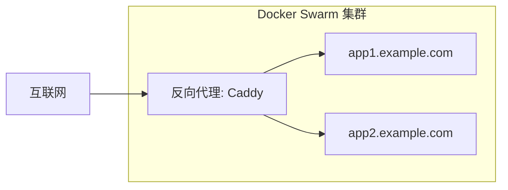

# 将 Yii 应用部署到 Docker Swarm 和 Caddy

本指南将引导你从空白服务器开始，将 Yii 应用部署到 [Docker Swarm](https://docs.docker.com/engine/swarm/)，使用 [Caddy](https://caddyserver.com/) 作为反向代理，并从容器注册表（[Forgejo](https://forgejo.org/) 或 [Gitea](https://about.gitea.com/)）进行部署。



## 先决条件

- 一台安装了 Linux 发行版（推荐 Ubuntu 22.04 LTS 或更高版本）的服务器
- 指向服务器 IP 地址的域名
- 服务器的 SSH 访问权限
- Docker 和命令行工具的基础知识

## 服务器准备

### 安装 Docker

有关安装说明，请参阅 [Docker 官方文档](https://docs.docker.com/engine/install/ubuntu/)。

### 初始化 Docker Swarm

将你的服务器初始化为 Docker Swarm 管理节点：

```bash
docker swarm init --advertise-addr <YOUR_SERVER_IP>
```

将 `<YOUR_SERVER_IP>` 替换为你服务器的公网 IP 地址。

### 设置反向代理网络

创建一个专用的 overlay 网络，用于反向代理与你的服务通信：

```bash
docker network create --driver=overlay reverse_proxy_public
```

## 设置 Caddy 作为反向代理

要将 Caddy 部署为反向代理，创建一个文件 `caddy-stack.yml`：

```yaml
services:
  caddy:
    image: lucaslorentz/caddy-docker-proxy:ci-alpine
    ports:
      - "80:80"
      - "443:443"
    volumes:
      - /var/run/docker.sock:/var/run/docker.sock
      - caddy_data:/data
    networks:
      - reverse_proxy_public

volumes:
  caddy_data:

networks:
  reverse_proxy_public:
    external: true
```

部署 Caddy：

```bash
docker stack deploy -c caddy-stack.yml caddy
```

Caddy 会自动发现带有 Caddy 标签的服务，并使用 Let's Encrypt 设置 HTTPS。Yii3 应用模板默认使用 Caddy 标签：

```yaml
deploy:
    labels:
      - caddy: ${PROD_HOST:-app.example.com}
      - caddy.reverse_proxy: "{{upstreams 80}}"
```

> [!IMPORTANT]
> 在部署带有 Caddy 标签的服务之前，请确保你的域名 DNS 记录已配置并指向你的服务器，因为 Let's Encrypt 需要进行域名验证。

## 设置容器注册表

你需要一个容器注册表来存储 Docker 镜像。选择以下选项之一。

### 选项 1：使用 Forgejo

要部署 Forgejo，创建一个文件 `forgejo-stack.yml`：

```yaml
services:
  forgejo:
    image: codeberg.org/forgejo/forgejo:1.21
    ports:
      - "3000:3000"
    volumes:
      - forgejo_data:/data
    networks:
      - reverse_proxy_public
    deploy:
      labels:
        - "caddy=git.example.com"
        - "caddy.reverse_proxy={{upstreams 3000}}"

volumes:
  forgejo_data:

networks:
  reverse_proxy_public:
    external: true
```

部署 Forgejo：

```bash
docker stack deploy -c forgejo-stack.yml forgejo
```

将 `git.example.com` 替换为你想要的子域名。

部署后，访问 `https://git.example.com` 并完成初始设置。确保在设置中启用容器注册表。

### 选项 2：使用 Gitea

要部署 Gitea，创建一个文件 `gitea-stack.yml`：

```yaml
services:
  gitea:
    image: gitea/gitea:latest
    ports:
      - "3000:3000"
    volumes:
      - gitea_data:/data
    networks:
      - reverse_proxy_public
    deploy:
      labels:
        - "caddy=git.example.com"
        - "caddy.reverse_proxy={{upstreams 3000}}"

volumes:
  gitea_data:

networks:
  reverse_proxy_public:
    external: true
```

部署 Gitea：

```bash
docker stack deploy -c gitea-stack.yml gitea
```

将 `git.example.com` 替换为你想要的子域名。

部署后，访问 `https://git.example.com` 并完成初始设置。确保在设置中启用容器注册表。

## 配置你的 Yii 应用

### 更新 Makefile 配置

[Yii 应用模板](https://github.com/yiisoft/app) 包含一个带有部署命令的 Makefile。更新项目中的 `docker/.env` 文件：

```bash
STACK_NAME=myapp

#
# 生产环境
#

PROD_HOST=app.example.com
PROD_SSH="ssh://user@your-server-ip"

IMAGE=git.example.com/username/myapp
IMAGE_TAG=latest
```

替换以下值：
- `STACK_NAME`：应用栈的唯一名称
- `PROD_HOST`：应用可访问的域名
- `PROD_SSH`：到服务器的 SSH 连接字符串（格式：`ssh://user@host`）
- `IMAGE`：注册表中容器镜像的完整路径
- `IMAGE_TAG`：镜像标签，通常是 `latest` 或版本号

### 配置生产环境

使用生产环境变量更新 `docker/prod/.env`：

```bash
APP_ENV=prod
YII_DEBUG=false
YII_ENV=prod

# 数据库配置
DB_HOST=db
DB_NAME=myapp
DB_USER=myapp
DB_PASSWORD=secure_password_here

# 添加其他特定于环境的变量
```

> [!WARNING]
> 切勿将敏感凭据提交到版本控制。对于敏感值，请使用 `docker/prod/override.env` 并将其添加到 `.gitignore`。

### 查看生产环境 Docker Compose 配置

默认的 `docker/prod/compose.yml` 包含：

```yaml
services:
  app:
    image: ${IMAGE}:${IMAGE_TAG}
    networks:
      - reverse_proxy_public
    volumes:
      - runtime:/app/runtime
      - caddy_data:/data
      - caddy_config:/config
    env_file:
      - path: ./prod/.env
      - path: ./prod/override.env
        required: false\
    environment:
      CADDY_EXTRA_CONFIG: 'auto_https off'
    deploy:
      replicas: 2
      update_config:
        delay: 10s
        parallelism: 1
        order: start-first
        failure_action: rollback
        monitor: 10s
      rollback_config:
        parallelism: 0
        order: stop-first
      restart_policy:
        condition: on-failure
        delay: 5s
        max_attempts: 3
        window: 120s
      labels:
        caddy: ${PROD_HOST:-app.example.com}
        caddy.reverse_proxy: "{{upstreams 80}}"
```

此配置：
- 运行 2 个副本以实现高可用性
- 使用滚动更新策略，失败时自动回滚
- 为反向代理配置 `labels` 以自动启用 HTTPS
- 禁用容器本身获取 HTTPS 证书，因为代理通过 HTTP 与容器通信。即 `auto_https off`。

如果需要数据库，将其添加到栈中：

```yaml
services:
  app:
    # ... 现有配置 ...
    
  db:
    image: postgres:15-alpine
    environment:
      POSTGRES_DB: myapp
      POSTGRES_USER: myapp
      POSTGRES_PASSWORD_FILE: /run/secrets/db_password
    volumes:
      - db_data:/var/lib/postgresql/data
    networks:
      - reverse_proxy_public
    deploy:
      placement:
        constraints:
          - node.role == manager
    secrets:
      - db_password

volumes:
  runtime:
  db_data:

secrets:
  db_password:
    external: true
```

在服务器上创建数据库 password secret：

```bash
echo "your_secure_password" | docker secret create db_password -
```

## 构建和推送镜像

### 在本地机器上设置 Docker 登录

配置 Docker 以向容器注册表进行身份验证：

```bash
docker login git.example.com
```

在提示时输入你的用户名和 password。

### 构建生产镜像

使用 Makefile 构建生产镜像：

```bash
make prod-build
```

这会运行 Makefile 中定义的命令：

```bash
docker build --file docker/Dockerfile --target prod --pull -t ${IMAGE}:${IMAGE_TAG} .
```

Dockerfile 使用多阶段构建：
1. 在构建器阶段安装 Composer 依赖项
2. 创建一个仅包含必要文件的最小生产镜像
3. 以非 root 用户（`www-data`）运行

### 将镜像推送到注册表

将构建的镜像推送到容器注册表：

```bash
make prod-push
```

这会执行：

```bash
docker push ${IMAGE}:${IMAGE_TAG}
```

## 部署到 Docker Swarm

### 配置 SSH 访问

设置到服务器的基于 SSH 密钥的身份验证：

```bash
# 生成 SSH 密钥（如果你还没有）
ssh-keygen -t ed25519 -C "your_email@example.com"

# 将密钥复制到服务器
ssh-copy-id user@your-server-ip

# 将 SSH 主机添加到 SSH 配置（~/.ssh/config）
cat >> ~/.ssh/config << EOF
Host docker-web
    HostName your-server-ip
    User user
    IdentityFile ~/.ssh/id_ed25519
EOF
```

### 设置 Docker 上下文

为远程部署创建 Docker 上下文：

```bash
docker context create swarm-prod --docker "host=ssh://docker-web"
```

或者，配置 `DOCKER_HOST` 环境变量：

```bash
export DOCKER_HOST=ssh://docker-web
```

### 部署应用

将应用栈部署到 Docker Swarm：

```bash
make prod-deploy
```

这会执行：

```bash
docker -H ${PROD_SSH} stack deploy --prune --detach=false --with-registry-auth -c docker/compose.yml -c docker/prod/compose.yml ${STACK_NAME}
```

`--with-registry-auth` 标志确保 Swarm 节点可以从私有注册表拉取镜像。

### 验证部署

检查服务状态：

```bash
docker -H ssh://docker-web service ls
docker -H ssh://docker-web service ps ${STACK_NAME}_app
```

查看日志：

```bash
docker -H ssh://docker-web service logs ${STACK_NAME}_app
```

## 监控和维护

### 查看服务日志

```bash
# 查看所有日志
docker -H ssh://docker-web service logs -f ${STACK_NAME}_app

# 查看最后 100 行日志
docker -H ssh://docker-web service logs --tail 100 ${STACK_NAME}_app

# 查看带时间戳的日志
docker -H ssh://docker-web service logs -t ${STACK_NAME}_app
```

### 扩展应用

调整副本数量：

```bash
docker -H ssh://docker-web service scale ${STACK_NAME}_app=3
```

或者更新 `docker/prod/compose.yml` 中的 `replicas` 值并重新部署。

### 资源限制

添加资源限制以防止容器消耗所有服务器资源。更新 `docker/prod/compose.yml`：

```yaml
services:
  app:
    # ... 现有配置 ...
    deploy:
      resources:
        limits:
          cpus: '0.5'
          memory: 512M
        reservations:
          cpus: '0.25'
          memory: 256M
```

## 安全考虑

### 使用 Docker secrets 保护敏感数据

不要使用环境变量，而是使用 Docker secrets 来保护敏感信息：

```bash
# 创建 secrets
echo "database_password" | docker secret create db_password -
echo "api_key" | docker secret create api_key -
```

更新 `docker/prod/compose.yml`：

```yaml
services:
  app:
    secrets:
      - db_password
      - api_key

secrets:
  db_password:
    external: true
  api_key:
    external: true
```

在应用中通过 `/run/secrets/secret_name` 访问 secrets。

### 设置防火墙

在服务器上配置 UFW（简单防火墙）：

```bash
# 允许 SSH
sudo ufw allow 22/tcp

# 允许 HTTP 和 HTTPS
sudo ufw allow 80/tcp
sudo ufw allow 443/tcp

# 允许 Docker Swarm 端口（如果你计划添加更多节点）
sudo ufw allow 2377/tcp
sudo ufw allow 7946/tcp
sudo ufw allow 7946/udp
sudo ufw allow 4789/udp

# 启用防火墙
sudo ufw enable
```

### 保持系统更新

定期更新服务器和 Docker：

```bash
# 更新系统包
sudo apt-get update && sudo apt-get upgrade -y

# 更新 Docker 镜像
docker -H ssh://docker-web service update --image ${IMAGE}:${IMAGE_TAG} ${STACK_NAME}_app
```

## 故障排除

### 服务无法启动

检查服务事件和日志：

```bash
docker -H ssh://docker-web service ps ${STACK_NAME}_app --no-trunc
docker -H ssh://docker-web service logs ${STACK_NAME}_app
```

常见问题：
- **镜像拉取错误**：使用 `docker -H ssh://docker-web login` 验证注册表身份验证
- **端口冲突**：确保没有其他服务使用端口 80/443
- **资源约束**：使用 `docker -H ssh://docker-web node ls` 检查可用资源

### SSL 证书问题

如果 Caddy 无法获取证书：
- 验证 DNS 是否指向你的服务器
- 检查端口 80 和 443 是否可从互联网访问
- 确保 Let's Encrypt 配置中的电子邮件有效
- 检查日志：`docker -H ssh://docker-web service logs caddy`

### 容器注册表连接问题

测试注册表连接：

```bash
# 从本地机器
docker pull git.example.com/username/myapp:latest

# 从服务器
docker -H ssh://docker-web pull git.example.com/username/myapp:latest
```

## 总结

你已成功将 Yii 应用部署到 Docker Swarm，包括：
- 容器注册表（Forgejo 或 Gitea）
- 通过 Caddy 自动启用 HTTPS
- 使用滚动更新实现零停机部署
- 使用多个副本实现高可用性

Makefile 命令简化了部署工作流程：
- `make prod-build` - 构建生产镜像
- `make prod-push` - 推送到注册表
- `make prod-deploy` - 部署到 Docker Swarm

更多信息，请参阅：
- [Yii 应用模板](https://github.com/yiisoft/app)
- [Docker Swarm 文档](https://docs.docker.com/engine/swarm/)
- [Caddy Docker 代理](https://github.com/lucaslorentz/caddy-docker-proxy)
